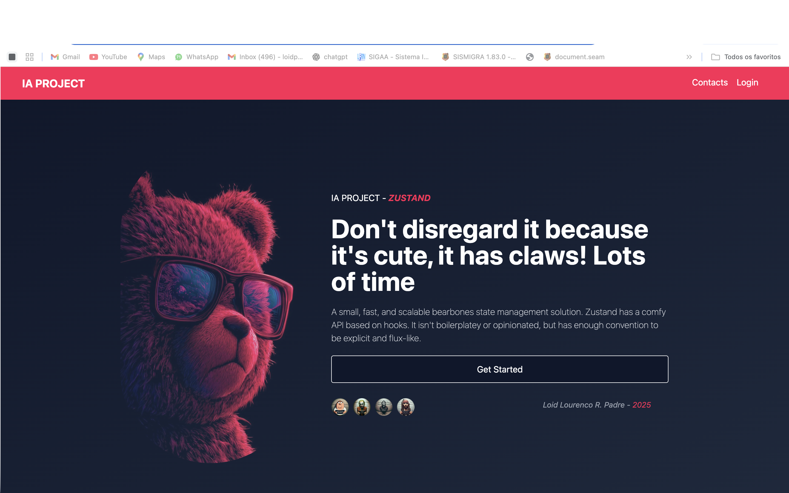
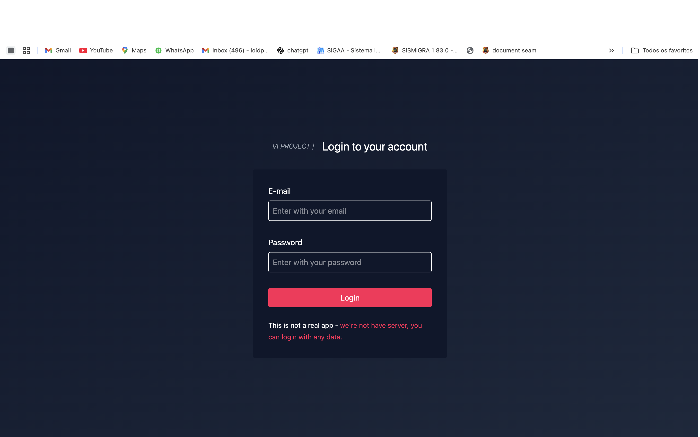
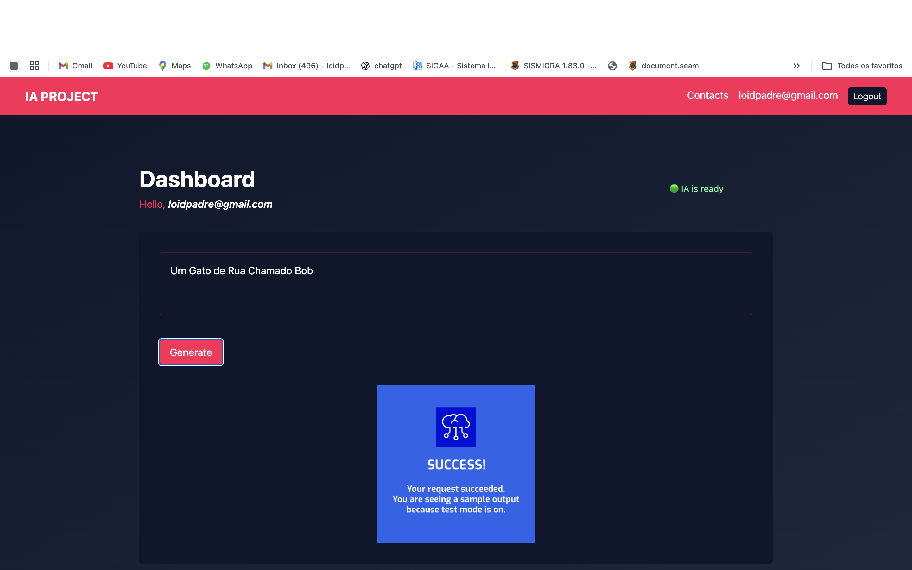

# Dashboard IA com Zustand, React Hook Form e Puter.js

Dashboard em React integrado ao Puter.js para geração de imagens com IA. Inclui login simulado com Zustand, verificação de prontidão da IA, envio de prompts e exibição da imagem gerada. Usa React Hook Form, Tailwind e React Router. **Créditos na API são necessários para uso real**.

---

## 🚀 Tecnologias Utilizadas
- [React](https://react.dev/)
- [Zustand](https://zustand-demo.pmnd.rs/)
- [React Hook Form](https://react-hook-form.com/)
- [React Router](https://reactrouter.com/)
- [Tailwind CSS](https://tailwindcss.com/)
- [Puter.js](https://puter.com/docs/puter-js)

---

## 📸 Demonstração






---

## 📦 Instalação e Uso

```bash
# Clone o repositório
git clone https://github.com/loidrodrigues/Zustand-project-react-hook-form.git

# Acesse a pasta
cd Zustand-project-react-hook-form

# Instale as dependências
npm install

# Inicie o projeto
npm run dev
